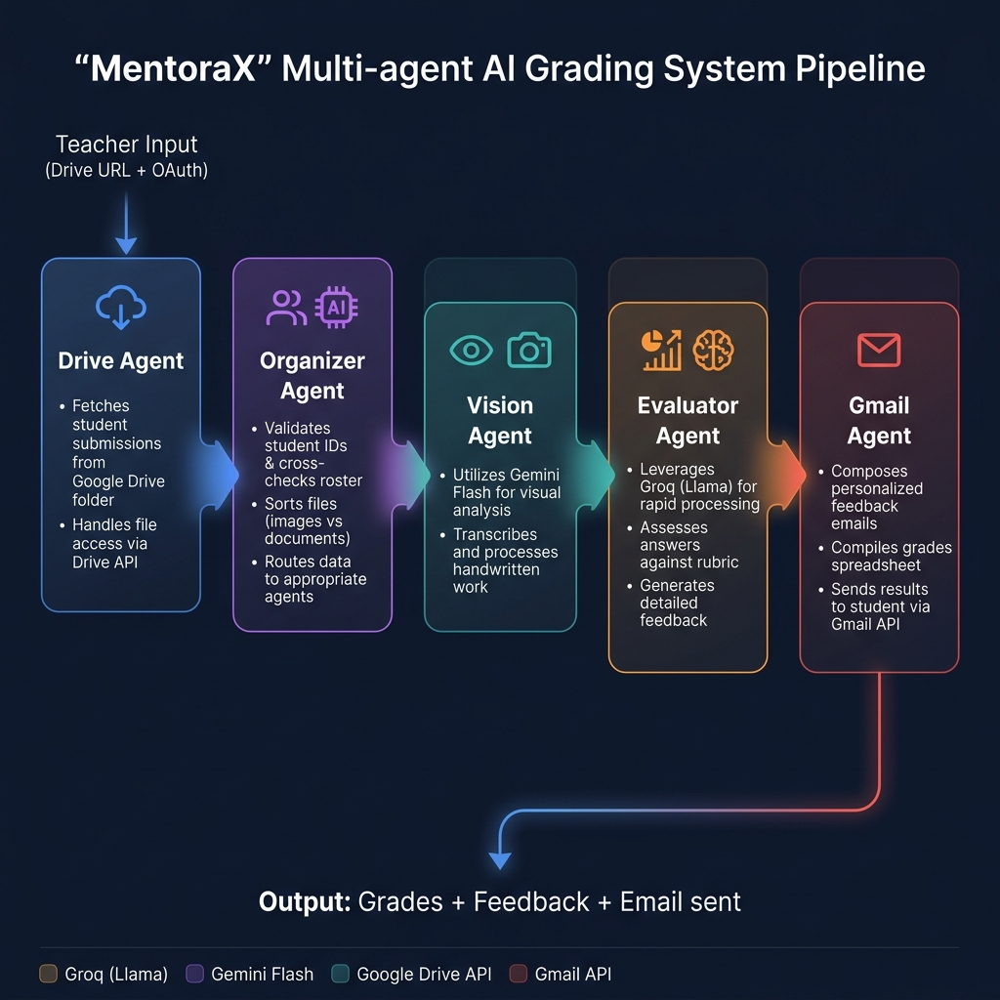

<div align="center">

# 🎓 MentoraX

### *AI-Powered Multi-Agent Automated Grading Pipeline*

[](https://react.dev)
[](https://nodejs.org)
[](https://ai.google.dev)
[](https://groq.com)
[](https://openrouter.ai)

> **DeltaCCE — Agentic AI Product Build Sprint**

| 👩‍💻 Irine Milton | 👨‍💻 Alan Jaison | 👨‍💻 Navaneeth KR |
|:---:|:---:|:---:|

🔗 **[GitHub Repository](https://github.com/irinemilton/MentoraX)** · 🎥 **[Demo Video](https://drive.google.com/drive/folders/1o8APUGRPMkUBXjoKoBDoEm3i67J7Lbbf?usp=sharing)**

</div>

---

## 🎯 Problem Statement

Teachers spend significant time collecting, evaluating, and providing feedback on student assignments submitted in different formats such as PDFs, images, handwritten answers, and code. Manual grading, identifying learning gaps, communicating results, and following up on improvements are repetitive and difficult to scale.

## 💡 Solution

**MentoraX** is an intelligent, multi-agent automated grading pipeline. It connects to Google Drive to fetch student submissions, uses advanced Vision AI to transcribe handwritten text, intelligently maps files to students via semantic reasoning, grades against a provided rubric, and automatically dispatches results via email — all in real-time.

---

## ✨ Key Features

| Feature | Description |
|---|---|
| 🌐 **Drive Agent** | Connects to Google Drive via OAuth 2.0 and recursively fetches all student assignments, rubrics, and CSV rosters |
| 🗂️ **Organizer Agent** | Uses Llama 3.3-70B to semantically fuzzy-match messy filenames to correct student emails |
| 👁️ **Vision Agent** | Processes handwritten images via Gemini Flash Vision with OpenRouter as an automatic fallback |
| 📊 **Evaluator Agent** | Grades transcribed text against the teacher's rubric using a 3-model fallback chain |
| 📧 **Gmail Agent** | Auto-dispatches grade emails; low-scoring submissions are held for teacher approval |
| ⚡ **Real-time UI** | React frontend with live SSE agent logs, score charts, and student records |

---

## 🏗️ Agent Architecture

### Pipeline Flow

```
👩‍🏫 Teacher
    │  Drive Folder URL + OAuth Token
    ▼
┌──────────────┐   ┌─────────────────┐   ┌──────────────┐   ┌──────────────────┐   ┌─────────────┐
│  Drive Agent │──▶│ Organizer Agent │──▶│ Vision Agent │──▶│ Evaluator Agent  │──▶│ Gmail Agent │
│ Google API   │   │ Llama 3.3-70B   │   │ Gemini Flash │   │ GPT-OSS-120B     │   │ Gmail API   │
│ File fetch   │   │ Fuzzy matching  │   │ + OpenRouter │   │ + Fallback chain │   │ OAuth send  │
└──────────────┘   └─────────────────┘   └──────────────┘   └──────────────────┘   └─────────────┘
    │
    ▼  Real-time SSE Logs streamed to React UI
📤 Output: Scores + Feedback + Emails + db.json
```

### Architecture Diagram



### Agent Details

| Agent | LLM / Tool | Role |
|---|---|---|
| 🌐 **Drive Agent** | Google Drive API v3 | Recursively list and download files via OAuth |
| 🗂️ **Organizer Agent** | Llama 3.3-70B (Groq) | Semantic fuzzy-matching of filenames to emails |
| 👁️ **Vision Agent** | Gemini Flash → OpenRouter fallback | Handwriting OCR — image to text |
| 📊 **Evaluator Agent** | GPT-OSS-120B → GPT-OSS-20B → Llama (Groq) | Rubric-based grading with 3-model fallback |
| 📧 **Gmail Agent** | Gmail API v1 | Auto-send feedback emails |

### Memory

| Type | Implementation | Stores |
|---|---|---|
| **Short-term** | In-process JS variables | `assignmentFiles[]`, `studentRecords[]`, `rubricContext`, `matchedMapping[]` |
| **Long-term** | `db.json` (append-only flat file) | All evaluation results with timestamps |

### RAG Pattern

- **Rubric file** → fetched from Drive at runtime → injected as Evaluator system prompt context
- **students.csv** → parsed into name→email mapping → fed to Organizer as grounding context
- **Handwritten images** → extracted by Vision Agent → used as the student "answer document" for grading

---

## 💻 Tech Stack

### Frontend

| Technology | Version | Purpose |
|---|---|---|
| React | 19 | UI Framework |
| TypeScript | ~6.0 | Type Safety |
| Vite | 8 | Build Tool & Dev Server |
| Framer Motion | 13 | Animations & transitions |
| Lucide React | 1.31 | Icons |
| @react-oauth/google | 0.13 | Google OAuth2 Sign-In |

### Backend

| Technology | Version | Purpose |
|---|---|---|
| Node.js + Express | 5 | HTTP Server & REST API |
| Server-Sent Events (SSE) | — | Real-time log streaming to frontend |
| googleapis | 174 | Google Drive API + Gmail API |
| @google/generative-ai | 0.24 | Gemini Flash Vision SDK |
| groq-sdk | 1.5 | Llama / GPT-OSS completions |
| axios | 1.19 | HTTP requests & file downloads |
| csv-parse | 7 | Student CSV roster parsing |
| dotenv | 17 | Environment variable management |

### AI / LLM Providers

| Model | Provider | Role |
|---|---|---|
| `gemini-flash-latest` | Google Generative AI | Vision OCR — primary |
| `google/gemini-flash-1.5` | OpenRouter | Vision OCR — fallback (no daily quota) |
| `llama-3.3-70b-versatile` | Groq | Organizer semantic matching |
| `openai/gpt-oss-120b` | Groq | Evaluator grading — primary |
| `openai/gpt-oss-20b` | Groq | Evaluator grading — fallback 1 |
| `llama-3.3-70b-versatile` | Groq | Evaluator grading — fallback 2 |

---

## 🚀 How to Run

### Prerequisites

- **Node.js** v18+ → [nodejs.org](https://nodejs.org)
- **npm** v8+ (bundled with Node.js)
- A **Google Cloud Project** with Drive API + Gmail API enabled
- API keys for **Groq**, **Gemini**, and **OpenRouter**

---

### Step 1 — Clone the Repository

```bash
git clone https://github.com/irinemilton/MentoraX.git
cd MentoraX
```

---

### Step 2 — Configure Environment Variables

There are **two `.env` files** to create.

#### 📄 `server/.env` — Backend Secrets

Create `MentoraX/server/.env`:

```env
# ── Groq API Key ───────────────────────────────────────────────────────────────
# Used by: Organizer Agent (Llama 3.3-70B) + Evaluator Agent (GPT-OSS-120B)
# Get it at: https://console.groq.com/keys
GROQ_API_KEY=gsk_your_groq_key_here

# ── Google Gemini API Key ──────────────────────────────────────────────────────
# Used by: Vision Agent (primary OCR — Gemini Flash)
# Get it at: https://aistudio.google.com/app/apikey
# Note: Free tier = 20 requests/day. Enable billing to remove quota.
GEMINI_API_KEY=your_gemini_api_key_here

# ── OpenRouter API Key ─────────────────────────────────────────────────────────
# Used by: Vision Agent (automatic fallback if Gemini quota exceeded)
# Model: google/gemini-flash-1.5 (pay-per-use, no daily quota wall)
# Get it at: https://openrouter.ai/keys
OPENROUTER_API_KEY=sk-or-your_openrouter_key_here
```

#### 📄 `.env` — Frontend Secrets

Create `MentoraX/.env` (the project root):

```env
# ── Google OAuth Client ID ─────────────────────────────────────────────────────
# Used by: React Google Sign-In (grants Drive + Gmail OAuth scopes)
# How to get:
#   1. Go to: https://console.cloud.google.com/apis/credentials
#   2. Create an OAuth 2.0 Client ID → Web Application
#   3. Authorized JavaScript Origins: http://localhost:5173
#   4. Authorized Redirect URIs:      http://localhost:5173
#   5. Enable APIs in your project:   Google Drive API + Gmail API
VITE_GOOGLE_CLIENT_ID=your_client_id.apps.googleusercontent.com
```

> ⚠️ Never commit either `.env` file. Both are already in `.gitignore`.

---

### Step 3 — Install & Start the Backend

```bash
cd server
npm install
npm start
```

Expected output:
```
Server listening on port 3001
```

---

### Step 4 — Install & Start the Frontend

Open a **new terminal** in the root `MentoraX/` directory:

```bash
cd ..         # back to MentoraX/ root (not inside server/)
npm install
npm run dev
```

Expected output:
```
VITE ready

➜  Local:   http://localhost:5173/
```

---

### Step 5 — Prepare Your Google Drive Folder

```
📁 Your Google Drive Folder
│   (Sharing: "Anyone with the link can view")
│
├── 📄 students.csv        ← columns: "Student name", "Email"
├── 📄 question.txt        ← grading rubric (filename must contain "rubric" or "question")
├── 🖼️ student1_page1.jpg  ← handwritten assignment images (JPEG/PNG)
├── 🖼️ student1_page2.jpg  ← multiple pages auto-grouped by student
└── 🖼️ student2_q1.jpeg
```

**students.csv format:**

```csv
Student name,Email
John Doe,john.doe@gmail.com
Jane Smith,jane.smith@gmail.com
```

---

### Step 6 — Run the Pipeline

1. Open **http://localhost:5173** in your browser
2. Click **Sign in with Google** — grant Drive + Gmail permissions
3. Paste your Google Drive folder URL into the input box
4. Click **▶ Start Evaluation**
5. Watch the 5 AI agents work in real-time on the activity log
6. View results in the **Stats** tab and **Search** tab

---

## 📁 Project Structure

```
MentoraX/
├── src/
│   ├── App.tsx                    # All UI components & agent pipeline trigger
│   ├── App.css                    # Component styles
│   ├── index.css                  # Global styles & design tokens
│   ├── main.tsx                   # React entry point
│   └── assets/
│       └── agent_architecture.png
├── server/
│   ├── index.js                   # Express backend + all 5 agent functions
│   ├── db.json                    # Auto-generated evaluation results database
│   ├── package.json
│   └── .env                       # ← Backend API keys (DO NOT COMMIT)
├── .env                           # ← Frontend OAuth Client ID (DO NOT COMMIT)
├── package.json
├── vite.config.ts
└── README.md
```

---

## 🔗 Links

| | |
|---|---|
| 📦 **Repository** | [github.com/irinemilton/MentoraX](https://github.com/irinemilton/MentoraX) |
| 🎥 **Demo Video** | [Watch Demo](https://drive.google.com/drive/folders/1o8APUGRPMkUBXjoKoBDoEm3i67J7Lbbf?usp=sharing) |

---

<div align="center">

Built with ❤️ by **Team MentoraX** &nbsp;·&nbsp; DeltaCCE Agentic AI Product Build Sprint

**Irine Milton &nbsp;·&nbsp; Alan Jaison &nbsp;·&nbsp; Navaneeth KR**

</div>
